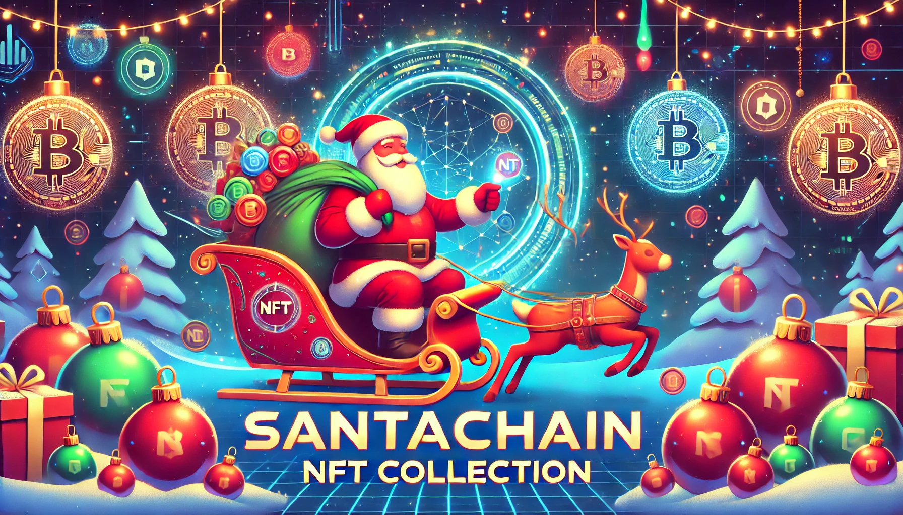

# SantaChain NFT Collection 🎅🔗



Welcome to **SantaChain**, a unique collection of Santa-themed NFTs built on the Ethereum blockchain. Embrace the festive spirit with exclusive digital collectibles that capture the magic of the holiday season.
## 🎊 Deployed Contract Address

```js
latest version of the contract is deployed at 0x79D2eC1A38d7Fe07fa862115407cF115724cd04f on the Holesky Testnet
```

## 🌟 Features

- **Unique Artworks:** Each SantaNFT is a one-of-a-kind digital artwork, meticulously crafted to embody the essence of Santa Claus.
- **Limited Supply:** Only 10,000 SantaNFTs will ever be minted, ensuring rarity and exclusivity.
- **Smart Contract Security:** Built with OpenZeppelin's trusted ERC-721 implementation, ensuring secure and reliable ownership.
- **Community Driven:** Join a vibrant community of collectors and enthusiasts celebrating the holiday spirit all year round.

## 📈 Roadmap

- **Phase 1:** Launch of the SantaNFT Collection
- **Phase 2:** Integration with major NFT marketplaces
- **Phase 3:** Exclusive airdrops and community events
- **Phase 4:** Expansion into augmented reality (AR) experiences

## 🛠️ Getting Started

### Prerequisites

- [Node.js](https://nodejs.org/) installed
- [Hardhat](https://hardhat.org/) installed globally (`npm install --global hardhat`)
- An Ethereum wallet (e.g., MetaMask) and access to a testnet or mainnet

### Installation

1. **Clone the Repository:**

   ```bash
   git clone https://github.com/yourusername/SantaChain.git
   cd SantaChain
